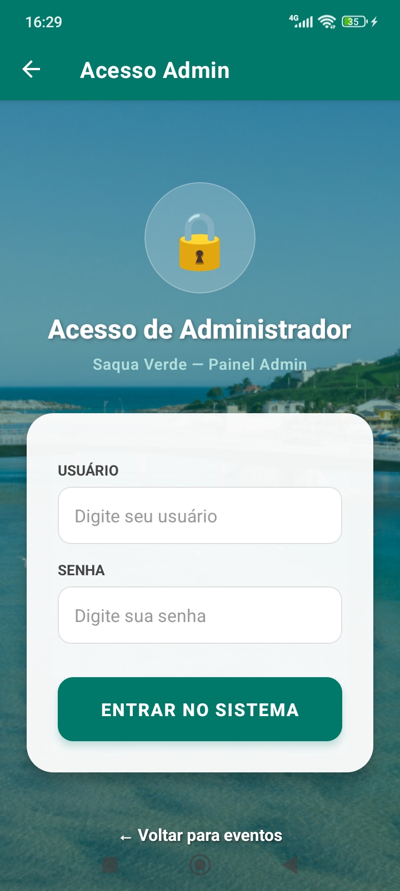
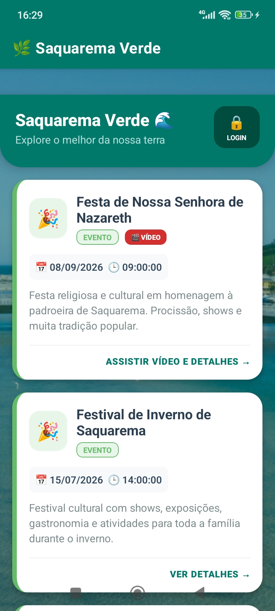

# 📱 Protótipos do Aplicativo (Telas)

Este documento apresenta a interface do usuário (UI) desenvolvida para o aplicativo **Saquarema Verde**, cobrindo o fluxo principal de visualização de eventos e o painel administrativo.

---

### 1. Tela Inicial (Feed de Eventos)
A tela principal exibe os eventos turísticos e culturais disponíveis na região de Saquarema, com filtros e cards informativos.
* **Destaques:** Nome do evento, data, hora, descrição curta e botões de ação para assistir vídeos ou ver detalhes.
* **Acesso:** Atalho para o login de administrador no topo superior direito.

---

### 2. Tela de Login (Acesso Admin)
Interface restrita para que os administradores do sistema possam se autenticar de forma segura.
* **Campos:** Usuário e Senha.
* **Navegação:** Opção de retornar para a tela de eventos pública.

---

### 3. Painel do Administrador (Novo Item)
Formulário exclusivo para criadores de conteúdo e administradores cadastrarem novos pontos de interesse ou eventos no aplicativo.
* **Campos de Entrada:** Nome do item, descrição, data e hora.
* **Categorias (Tags):** Evento, Praia, Trilha e Ponto Turístico.
* **Navegação Inferior:** Alternância rápida entre o início e o painel de configurações.

